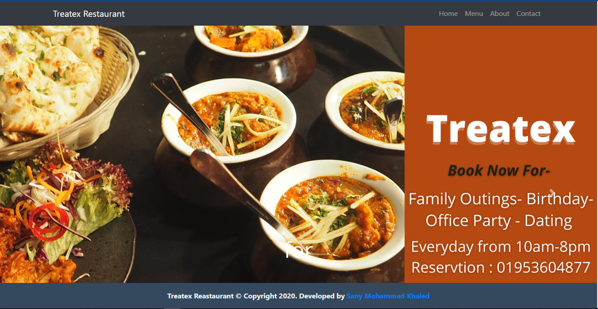
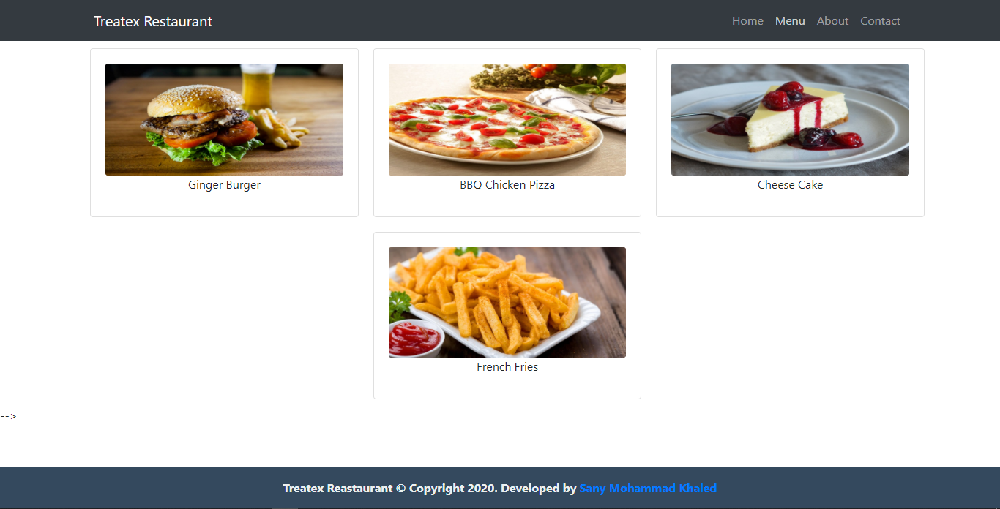
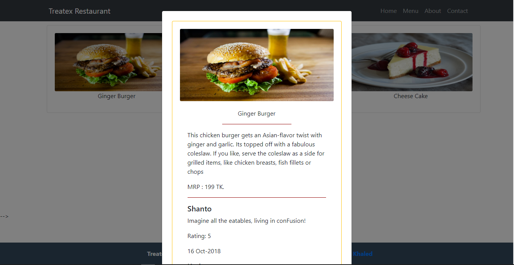
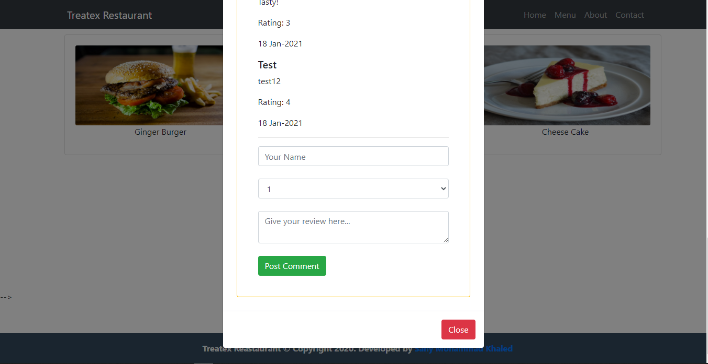
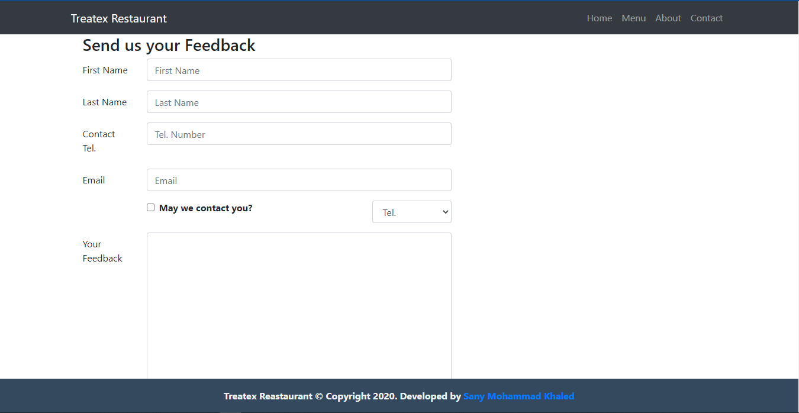
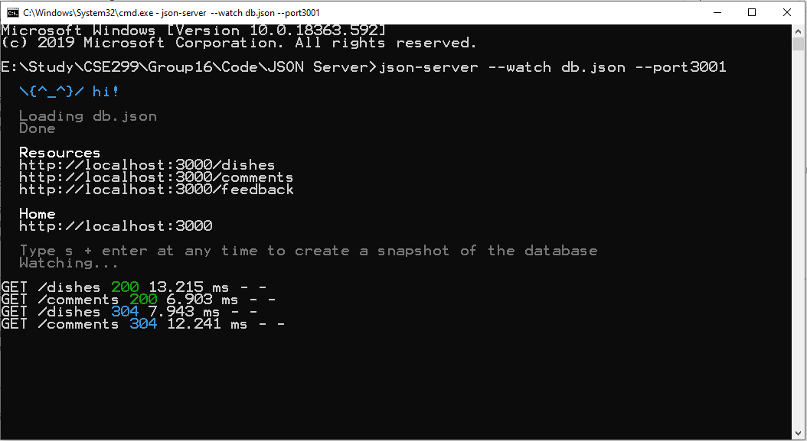

&nbsp;

&nbsp;

<strong></strong>

<strong>North South University</strong>

Department of Electrical &amp; Computer Engineering

<strong>Project Report</strong>

<strong>Group No</strong>: 16

<strong>Fall 2020</strong>

<strong>Project Name </strong>: Treatex Restaurant

<strong>Course No</strong>: CSE 299 <strong>Sec</strong><strong>:</strong> 02

<strong>Faculty</strong>: Shaikh Shawon Arefin Shimon (Sas3)

<strong><u>Member 1</u></strong><u>:</u>

<strong>Name</strong><strong>:</strong> Sany Mohammad Khaled

<strong>ID</strong><strong>:&nbsp; </strong>1711853042

<strong>Email</strong><strong>:</strong> <a href="mailto:sany.khaled@northsouth.edu">sany.khaled@northsouth.edu</a>

<strong>Git Repository</strong><strong>: </strong><a href="https://github.com/NSU-FA20-CSE299-2/Group16">https://github.com/NSU-FA20-CSE299-2/Group16</a>

<strong>Date Prepared</strong><strong>: </strong>22/01/2021

<strong>&nbsp;</strong>

<strong>&nbsp;</strong>

# Table of Contents:

    1. Introduction
    2. Software Specification
    3. Technology
    4. Business Plan
    5. Conclusion

<strong>INTRODUCTION</strong>

In today’s world, Food has become more than just a necessity. The restaurant business has become more challenging and competitive day by day. We often see their business fall apart after doing all this because people usually do not know much about it. There is nothing where people can know anything about restaurants in one place.

My goal was to make a web application where people can know more about various restaurants in one place. From anywhere, they can check the details about the different restaurants, what service they provide, which items are available, where the restaurant is located, and many more. People can also give reviews on food items. 

## 2. Software Specification

Implemented Features :

I have implemented a web app that stores the information about various foods of the restaurant, price and details information. Customers can post theier review and comments in a particular food. They can also give feedbabck for the restaurant. 

### 2.1 Home Page

  

After enter the address of the website, user first of all see this page. Here he or she can view a slider containing information about the restaurant and promotional offers of the restaurant

### 2.2 Menu

  

In the menu page, a user can find the items of the restaurant. Menu contains the image of the item and a short tittle. This section is clickable.

### 2.3 Menu Detail

  

After someone click on a Menu, a modal view opens up. Here he or she can view the price and details of the item. They can also check the ratings and food review of previous customer

### 2.4 Review Section

  

After opening the modal, they can see the revew as well as give the review. He or she needs to fill his or her name, rating and the food review.Instantly it will be shown on the review section

### 2.5 Feedback

  

If anyone wants to give any feedback to the restaurant owner, he or she can post it here with all the degtails

### 2.6 Server

  

The Item info,feedback texts and comments are stored in a local JSON server

### 2.7 About

I couldn’t  create this section of the website. A chatting system between restaurant and customer was proposed Hopefully I will work about it and integrate it later

## 3)Technology:

### 3.1 Proposed Technology Stack

I selected Github as project management tool, For backend site of this site I selected Javascript React framework, Textbase JSON server for database management and Frontend part I selected HTML5, CSS3, Reactstrap and other necessary tools and language. I worked on VS code text editor also.

### 3.2 Implemented Technology Stack

I used Github as a project management tool. I use kanban board of Github as task allocator. For Frontend part, I use React, HTML5 and CSS3 and Reactstrap. And I used VS code as a text editor. On the other hand for Backend, I have used JSON server with Rest API. 

## 4)Business Plan:

This web app is now only based on one restaurant.There will be more restaurant added to a mother web app as like yelp. Promotional ads and paid promotion of different restaurant will be the main source of business. Subscription fee for including restaurant to the website is another way.

## 5. Conclusion

Treatex Restaurant is a all in one kind of app. They can compare the price, know which food is available, which restaurant’s environment is good to go with families or friends or with beloved one. 

By this dedicated platform people can save time and money and it gives them a better option to enjoy their time and food.

One platform, many restaurants.
